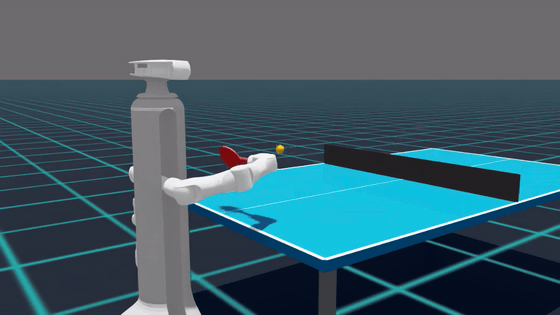
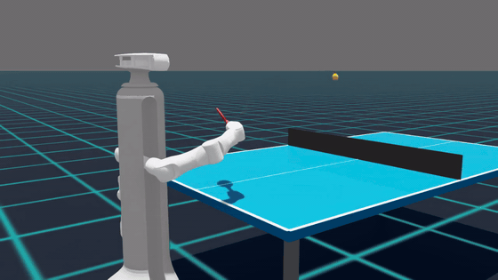

# Unitree RL Lab — A1 Table Tennis (Forehand)

[](https://docs.omniverse.nvidia.com/isaacsim/latest/overview.html)
[](https://isaac-sim.github.io/IsaacLab)
[](https://opensource.org/license/apache-2-0)
[](https://discord.gg/ZwcVwxv5rq)


<p align="center">
  <a href="doc/a1_tabletennis_cover.mp4">
    
    
  </a>
</p>

<p align="center"><sub>点击图片查看完整视频</sub></p>


## Overview

本项目使用 **A1 七自由度机械臂 + 球拍** 做乒乓球反手击球的强化学习。

- 离线 npz 参考挥拍轨迹（关键帧 + 样条插值）。
- PPO 在参考动作上叠加 residual + 相位快慢，目标把球击过网、落到对方台面。
- 仅右臂 7 DoF 受控：`joint_yb_1 … joint_yb_7`；正则化（torque/acc/limit/action_rate）只作用右臂。
- 球资源：`data/robots/a1/{table_tennis_table.usd, ping_pong_ball.usd}`。

参考动作 npz 与生成脚本：
[source/unitree_rl_lab/unitree_rl_lab/tasks/table_tennis/robots/a1/forehand/](source/unitree_rl_lab/unitree_rl_lab/tasks/table_tennis/robots/a1/forehand/)。


## Installation

> ⚠️ **关于命名**：本项目里的 **"A1"** 指 7-DoF 协作臂 + 球拍（[data/robots/a1/a1.usd](source/unitree_rl_lab/data/robots/a1/a1.usd)），**不是** Unitree 商业产品 A1（四足）。
> **"X1"** 指 EE + 升降柱（[data/robots/x1/ee_with_lift.usd](source/unitree_rl_lab/data/robots/x1/ee_with_lift.usd)）。
> **乒乓球任务的所有 USD（机器人/球桌/球）已打包在仓库内**，不依赖外部 `UNITREE_MODEL_DIR`。

### Requirements

| Dependency | Version |
| --- | --- |
| Isaac Sim | 5.1.0 |
| Isaac Lab | 2.3.0 |
| Python | 3.11 |
| OS | Ubuntu 20.04 / 22.04 |
| GPU | NVIDIA RTX，建议 ≥ 8 GB 显存，驱动 ≥ 535 |

详细安装见 [Isaac Lab 官方安装指南](https://isaac-sim.github.io/IsaacLab/main/source/setup/installation/index.html)。
Isaac Sim 与 Isaac Lab 版本须严格匹配，否则 API 不兼容。

### Steps

1. **安装 Isaac Lab**（按官方指南，conda 环境名按你本地实际，本仓库默认 `isaaclab`）。

2. **Clone 本仓库**（与 IsaacLab 目录平级，不要放在 IsaacLab 内部）：

   ```bash
   git clone https://github.com/cccxhua/PPO-pingpong.git unitree_rl_lab
   cd unitree_rl_lab
   ```

3. **editable 模式安装本项目**：

   ```bash
   conda activate isaaclab     # 你本地的 conda 环境名 (上游 README 默认 env_isaaclab)
   ./unitree_rl_lab.sh -i      # 内部做: git lfs install + pip install -e + 写 conda activate.d + argcomplete
   # 重启 shell 让环境变更生效
   ```

4. **验证 `A1-TableTennis` 已注册**：

   ```bash
   ./unitree_rl_lab.sh -l   # 比 isaaclab 自带列出更快
   # 或者
   /workspace/isaaclab/_isaac_sim/python.sh scripts/list_envs.py
   ```


## Workflow

> 所有命令在 `cd /root/unitree_rl_lab` 下运行。
> 如果是在阿里云上训练记得带 `--headless`。

### 1. Train（PPO）

```bash
# 起训
/workspace/isaaclab/_isaac_sim/python.sh scripts/rsl_rl/train.py \
    --task A1-TableTennis --headless \
    --num_envs 4096

# 等价于：./unitree_rl_lab.sh -t --task A1-TableTennis (支持 task 名补全)
```

恢复训练：

```bash
/workspace/isaaclab/_isaac_sim/python.sh scripts/rsl_rl/train.py \
    --task A1-TableTennis --headless \
    --resume --load_run "2026-06-03_09-39-52" --checkpoint "model_30000.pt"
```

常用参数：`--num_envs --max_iterations --seed --resume --load_run --checkpoint --experiment_name --run_name --logger {tensorboard,wandb}`。

PPO 配置：[source/unitree_rl_lab/unitree_rl_lab/tasks/table_tennis/agents/rsl_rl_ppo_cfg.py](source/unitree_rl_lab/unitree_rl_lab/tasks/table_tennis/agents/rsl_rl_ppo_cfg.py) 中
`A1TableTennisPPORunnerCfg`（lr=1e-3、value_loss_coef=1.0、epochs=5、desired_kl=0.01；`experiment_name="a1_tabletennis"`）。

环境配置入口：[source/unitree_rl_lab/unitree_rl_lab/tasks/table_tennis/robots/a1/forehand/env_cfg.py](source/unitree_rl_lab/unitree_rl_lab/tasks/table_tennis/robots/a1/forehand/env_cfg.py)。

域随机化分级（环境变量）：

```bash
DR_STAGE=0  # 0 确定性基线; 1 +发球范围; 2 +动作延迟; 3 +PD/扭矩/观测噪声/观测延迟
SERVE_STAGE=0  # 0 中点单点; 1 A1 50% 路径; 2 A2 真人 5/95%; 3/4 B 路径(发球出生点后移)
```

### 2. Play（回放训练得到的策略）

```bash
/workspace/isaaclab/_isaac_sim/python.sh scripts/rsl_rl/play.py \
    --task A1-TableTennis --headless \
    --load_run "2026-06-03_09-39-52" --checkpoint "model_30000.pt" \
    --num_envs 1 --video --video_length 400

# 等价于：./unitree_rl_lab.sh -p --task A1-TableTennis
```

输出：

- `logs/rsl_rl/a1_tabletennis/<run>/videos/play/rl-video-step-0.mp4`
- `logs/rsl_rl/a1_tabletennis/<run>/play_joint_pos.{npz,txt}` —— 用于离线对比关节轨迹。

### 3. Ref Play（参考动作诊断，绕过策略）

短任务，直接看 npz 参考挥拍本身能不能把球击过去：

```bash
/workspace/isaaclab/_isaac_sim/python.sh scripts/rsl_rl/play_pure_ref.py \
    --task A1-TableTennis --headless \
    --video --video_length 500 \
    --npz source/unitree_rl_lab/unitree_rl_lab/tasks/table_tennis/robots/a1/forehand/forehand_middle_a1_whip.npz \
    --ball_preset middle --arrive_time 0.51 --hit_phase 0.54 \
    --output_dir logs/pure_ref/a1_middle_diag
```

参数说明：

| 参数 | 含义 |
|------|------|
| `--npz` | 自定义参考动作 npz 路径 |
| `--ball_preset` | `middle` / `left` / `right` / `high` |
| `--arrive_time` | 覆盖球到达时间估计（对齐 `CommandsCfg.ball_arrive_time_est`） |
| `--hit_phase` | 覆盖击球时相（对齐 `CommandsCfg.hit_phase`） |
| `--output_dir` | **务必使用新路径**，避免覆盖已有诊断 |

可用 npz（[robots/a1/forehand/](source/unitree_rl_lab/unitree_rl_lab/tasks/table_tennis/robots/a1/forehand/)）：

- `forehand_middle_a1_whip.npz`（当前 motion_files 启用）
- `forehand_middle_a1.npz` / `forehand_middle_a1_v2.npz` / `forehand_middle_a1_csv.npz`
- `forehand_middle_a1_whip_flat.npz` / `forehand_middle_a1_whip_flat2.npz`
- `forehand_left_a1.npz` / `forehand_right_a1.npz` / `forehand_right_v52_a1.npz`
- 探针：`probe_a1.npz` / `probe_a1_retract.npz` / `probe_a1_shoulder.npz` / `probe_a1_sustained.npz` / `probe_a1_wristface.npz`

诊断输出（`--output_dir`）：

| 文件 | 含义 |
|------|------|
| `rl-video-step-0.mp4` | 回放视频 |
| `torques.txt` | 7 关节扭矩随时间——查是否饱和到 effort_limit |
| `joints.txt` | 关节角实际 vs 目标——查跟踪误差 |
| `paddle_traj.txt` | 球拍位置 + 本地坐标三轴——查拍面朝向 |
| `ball_traj.txt` | 球 xyz 轨迹——查落点 / 过网 |
| 控制台 | 清台率、直接清台率等接触统计 |

参考动作版本规范：右路等迭代版本用 `_vNN`（v50→v52→…）递增，**新版本另存新文件，绝不覆盖旧 npz**。


## Acknowledgements

- [IsaacLab](https://github.com/isaac-sim/IsaacLab) — 训练 / 运行框架基础。
- [mujoco](https://github.com/google-deepmind/mujoco.git) — sim2sim 验证仿真。
- [robot_lab](https://github.com/fan-ziqi/robot_lab) — 项目结构与部分实现参考。
- [whole_body_tracking](https://github.com/HybridRobotics/whole_body_tracking) — 通用人形动作跟踪框架参考。
